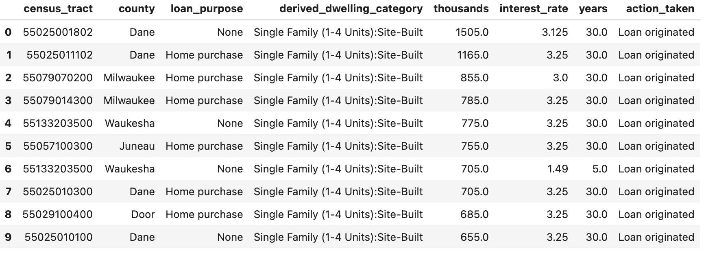
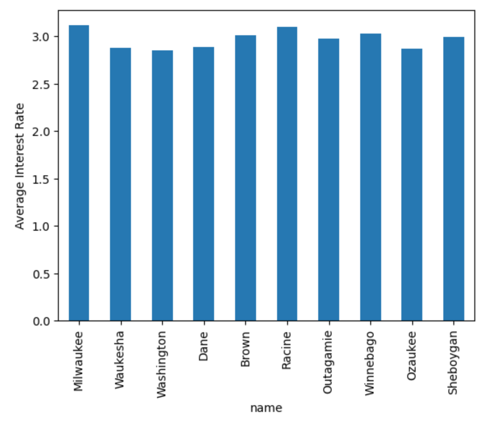
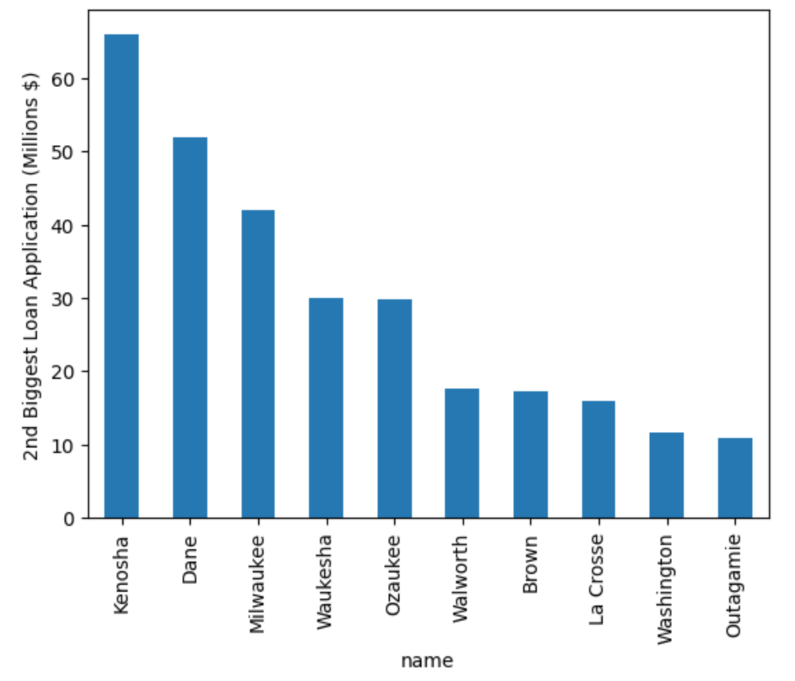
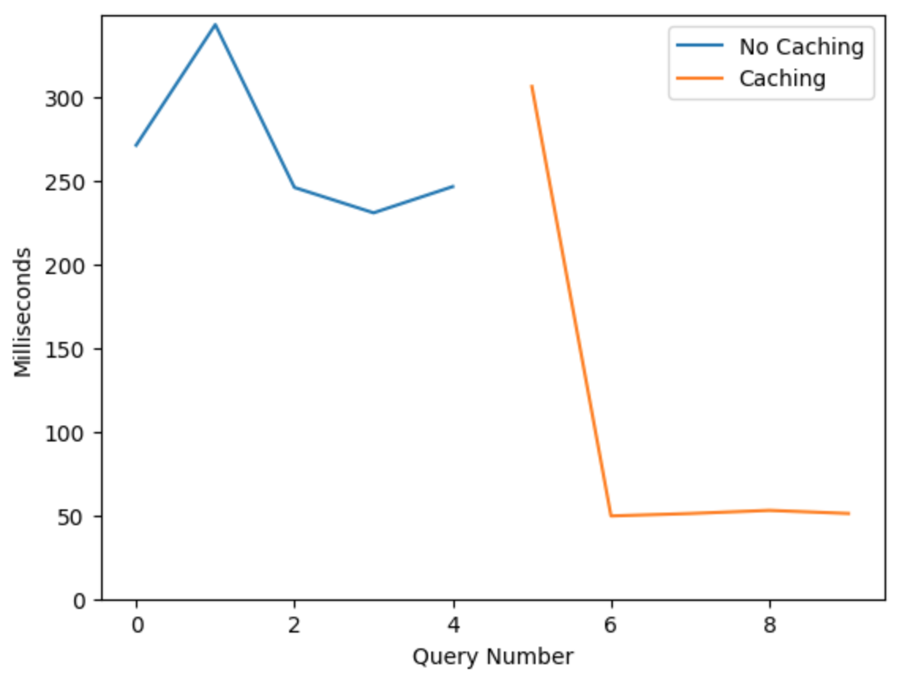
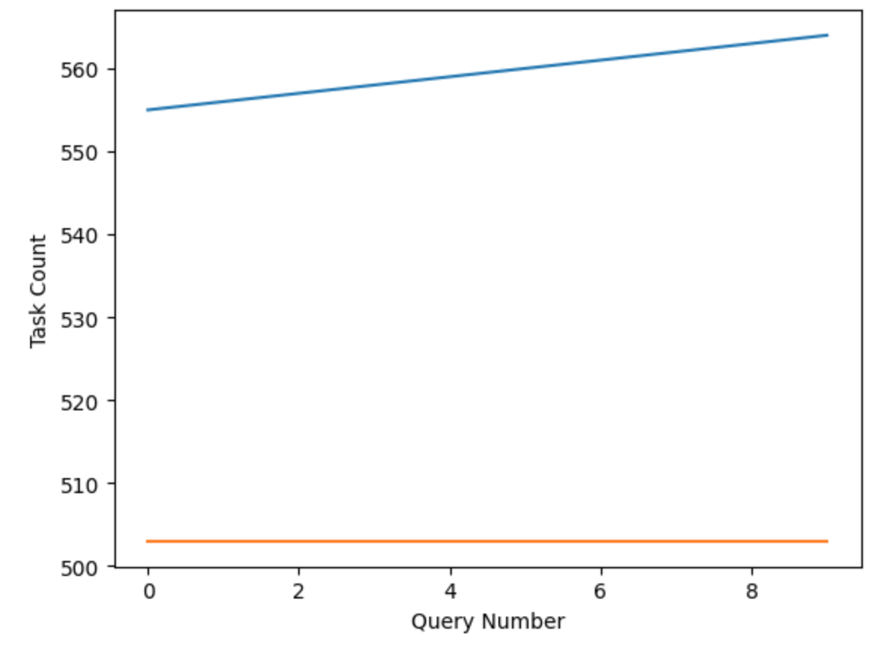

# P4 (8% of grade): Spark, Loan Applications

## Overview

In this project, we'll use Spark to analyze loan applications in WI.
You'll load your data to Hive tables and views so you can easily query
them.  The big table (loans) has many IDs in columns; you'll need to
join these against other tables/views to determine the meaning of
these IDs.  In addition to your analysis, you'll study the performance
impact of caching and bucketing.

**Important:** you'll answer ten questions in this project.  Paste
  each question and it's number (e.g., "# Q1: ...") as a comment in your
  notebook prior to each answer so we can easily search your notebook
  and give you credit for your answers.

Learning objectives:
* load data to Hive tables and views
* write queries that use filtering, joining, grouping, and windowing
* interpret Spark query explanations
* optimize queries with bucketing and caching

Before starting, please review the [general project directions](../projects.md).

## Corrections/Clarifications

* Mar 21: removed "agency" views to create
* Mar 25: clarified that Q8 is for top 10; this is over all loans (not one bank)
* Mar 29: made q4 more flexible to accomodate different approaches
* Mar 30: Q6 is asking under what situation (when) you need Network I/O. If one of your queries does not need Network I/O explain why.

## Machine Setup

~4 GB is barely enough for this project.  Take a moment to enable a 1
GB swap file to supplement.  A swap file exists on storage, but acts
as extra memory.  Note this has performance implications as storage is
much slower than RAM.

```
# https://www.digitalocean.com/community/tutorials/how-to-add-swap-space-on-ubuntu-22-04
sudo fallocate -l 1G /swapfile
sudo chmod 600 /swapfile
sudo mkswap /swapfile
sudo swapon /swapfile
# htop should show 1 GB of swap beneath memory
```

## Part 1: Data Setup

Setup an environment with three containers, running the following:
1. HDFS Namenode and Datanode on fresh file system; Spark boss; JupyterLab
2. Spark worker
2. Spark worker

For inspiration, here are some files that could help: [Container Setup Files](./containers.md)

Create a `p4.ipynb` notebook and create a session.  We'll enable Hive, with metadata stored on HDFS:

```python
from pyspark.sql import SparkSession
spark = (SparkSession.builder.appName("cs544")
         .master("spark://main:7077")
         .config("spark.executor.memory", "512M")
         .config("spark.sql.warehouse.dir", "hdfs://main:9000/user/hive/warehouse")
         .enableHiveSupport()
         .getOrCreate())
```

Download these files for this project:
* https://pages.cs.wisc.edu/~harter/cs639/data/hdma-wi-2021.zip
* https://pages.cs.wisc.edu/~harter/cs639/data/arid2017_to_lei_xref_csv.zip
* https://pages.cs.wisc.edu/~harter/cs639/data/code_sheets.zip

Each zip contains one or more CSV files.  Upload each CSV to HDFS.
You can use shell commands and/or Python code, but be sure to show
your work in `p4.ipynb`.  Register or load the data into Spark.

Requirements:
* let Spark infer the schema
* use Spark options/functions so that you can run the data setup code more than one, and it will simply replace previous data
* **code_sheets.zip:** create these temporary views corresponding to the CSVs by the same name: "ethnicity", "race", "sex", "states", "counties", "tracts", "action_taken", "denial_reason", "loan_type", "loan_purpose", "preapproval", "property_type"
* **arid2017_to_lei_xref_csv.zip:** load the data to a table named "banks"
* **hdma-wi-2021.zip:** load the data to a table named "loans"
* the "loans" table should be divide into 8 buckets by the `county_code` column

#### Q1: what tables are in our warehouse?

You can use `spark.sql("SHOW TABLES").show()` to answer.  It should look like this:

```
+---------+-------------+-----------+
|namespace|    tableName|isTemporary|
+---------+-------------+-----------+
|  default|        banks|      false|
|  default|        loans|      false|
|         | action_taken|       true|
|         |     counties|       true|
|         |denial_reason|       true|
|         |    ethnicity|       true|
|         | loan_purpose|       true|
|         |    loan_type|       true|
|         |  preapproval|       true|
|         |property_type|       true|
|         |         race|       true|
|         |          sex|       true|
|         |       states|       true|
|         |       tracts|       true|
+---------+-------------+-----------+
```

## Part 2: Filter and Join

#### Q2: how many banks contain the word "first" in their name?  Which ones contain "second"?

Your filtering should be case insensative.  We're looking for a number
for the first part and an actual listing for the second part.

#### Q3: how many loan applications has your "favorite" bank received in the dataset?

Browse the dataset a bit and pick a "favorite" bank for these
questions.  It could be one you use, or has an interesting name, or is
popular in WI.  You need to pick one that has at least a couple
hundred loans in the dataset

Use an `INNER JOIN` between `banks` and `loans` to anser this
question.  `lei` in loans lets you identify the bank.  Filter on
`respondent_name` (do NOT hardcode the LEI).

#### Q4: what does `results.explain("formatted")` tell us about Spark's query plan for Q3?

Show `results.explain("formatted")` and write a comment making observations about the following:
1. which table is sent to every executor via a `BroadcastExchange` operation?
2. on which tables is "is not null" filtering added by the optimizer?
3. does the plan involve `HashAggregate`s (depending on how you write the query, it may or may not)?  If so, which ones?

#### Q5: what are the top 10 biggest loans (in terms of `loan_amount`) that were approved by your favorite bank?

A loan is approved if `action_taken` is "Loan originated".  Your
answer should have the following columns: census_tract, county,
loan_purpose, derived_dwelling_category, thousands, interest_rate,
years, action_taken

Join with the appropriate views to get the values for these columns.
It should look like the following (though will differ depending on
which bank you picked):



Use `LEFT JOIN`s so that we don't ignore loans with missing values
(for example, you can see some `None`s in the `loan_purpose` column of
the example).

Joining `counties` will be a very tricky.  Tips:

* sometimes multiple rows in `counties` have the same `STATE, COUNTY, NAME` combination; eliminate duplicates before joining
* `county_code` in `loans` is actually the state and county codes concatenated together whereas `counties` has these as separate columns.  For example, `55025` is the `county_code` for Dane county in loans, but this will show up as STATE=55 and COUNTY=25 in the `counties` view.  Be careful because counties have 3-digit codes (like `025`) but the `counties` view doesn't have leading zeros.

## Part 3: GROUPY BY and Windowing

#### Q6: when computing a MEAN aggregate per group of loans, under what situation (when) do we require network I/O between the `partial_mean` and `mean` operations?

Write some simple `GROUP BY` queries on `loans` and call .explain().  Try grouping by both the `county_code` and `lei` columns.

If a network transfer (network I/O) is necessary for one query but not the other,
write a comment explaining why.  You might want to look back at how
you loaded the data to a Hive table earlier.

#### Q7: what are the average interest rates for Wells Fargo applications for the ten counties where Wells Fargo receives the most applications?

Answer with a bar plot like this:



The bars are sorted by the number of applications in each county (for
example, most applications are in Milwaukee, Waukesha is second most,
etc).

#### Q8: what is the second biggest loan application amount in each county?  (answer for top 10 counties).

Note this this is computed over all loans, not just for one bank.

Answer with a plot like the following:



Hint: if we were asking for the biggest in each county, you would use
`GROUP BY` and `MAX`.  We're asking for the second biggest, so you
should see if a windowing function can help.

## Part 4: Caching

Create a DataFrame from the following query:

```sql
SELECT interest_rate
FROM banks
INNER JOIN loans
ON banks.lei_2020 = loans.lei 
WHERE banks.respondent_name = 'Wells Fargo Bank, National Association'
```

#### Q9: what is the cost of caching and the impact on subsequent queries?

Write a loop that calls `.count()` on your DataFrame ten times.
Measure the latency in milliseconds each time.  On the 5th time, cache
the DataFrame.

Answer with a scatter or line plot showing the latency of each query
execution tha distinguishes between caching or not.  Here's one way to
visualize it:



#### Q10: what is the impact of caching a single partition on load balance?

Repartition your DataFrame to have 1 partition and cache it again.
Write another loop that calls `.count()` ten times.

After each query, use Spark's REST API to check how many tasks each executor has completed: https://spark.apache.org/docs/latest/monitoring.html#rest-api

Make a plot like the following to show how much work each has completed:



Hints:
* you can use `http://localhost:4040/api/v1/applications` to find your app's ID
* you can use `http://localhost:4040/api/v1/applications/{app_id}/executors` to find stats about executors for your app
* a correct experiment should show one executor always does the work (whichever one is caching the partition).  Results may vary in terms of which of the two executors do the work or initial  counts prior to the start of the experiment

## Submission

We should be able to run the following on your submission to create the mini cluster:

```
docker build -t p4-image ./image
docker compose up -d
```

We should then be able to open `http://localhost:5000/lab`, find your
notebook, and run it.

## Approximate Rubric:

The following is approximately how we will grade, but we may make
changes if we overlooked an important part of the specification or did
not consider a common mistake.

1. [x/1] question 1 (part 1)
2. [x/1] question 2 (part 2)
3. [x/1] question 3 (part 2)
4. [x/1] question 4 (part 2)
5. [x/1] question 5 (part 2)
6. [x/1] question 6 (part 3)
7. [x/1] question 7 (part 3)
8. [x/1] question 8 (part 3)
9. [x/1] question 9 (part 4)
10. [x/1] question 10 (part 4)
