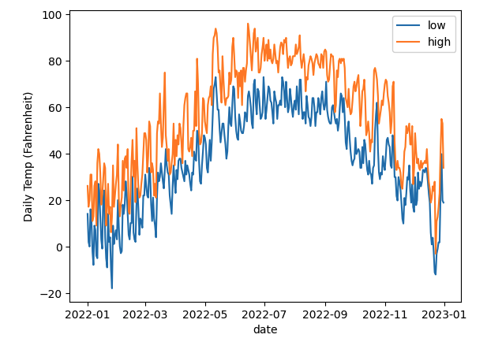

# DRAFT!  Don't start yet.

# P5 (regular project): Cassandra, Weather Data

## Overview

NOAA (National Oceanic and Atmospheric Administration) collects
weather data from all over the world.  In this project, you'll explore
how you could (1) store this data in Cassandra, (2) write a server for
data collection, and (3) analyze the collected data via Spark.

We'll also explore read/write availability tradeoffs.  When always
want sensors to be able to upload data, but it is OK if we cannot
always read the latest stats (we prefer an error over inconsistent
results).

Learning objectives:
* create a schema for a Cassandra table that uses a partition key, cluster key, and static column
* configure Spark catalogs to gain access to external data sources
* create custom Cassandra types
* create custom Spark UDFs (user defined functions)
* configure queries to tradeoff read/write availability
* refresh a stale cache

Before starting, please review the [general project directions](../projects.md).

## Part 1: Station Metadata

Using Docker compose, launch a cluster three Cassandra nodes.  For
inspiration, here are some files that could help: [Container Setup
Files](./containers.md).

Use `docker ps` to see which container is using host port
127.0.0.1:5000, then manually start Jupyter inside that container:

```
docker exec -it -d ???? python3 -m jupyterlab --no-browser --ip=0.0.0.0 --port=5000 --allow-root --NotebookApp.token=''
```

Create a `p5.ipynb` notebook for your work.  Your notebook should
start by connecting to the Cassandra cluster and running `drop
keyspace if exists weather`.

Feel free to use the starter code to connect the Cassandra cluster
```
from cassandra.cluster import Cluster
try:
    cluster = Cluster(['p5-db-1', 'p5-db-2', 'p5-db-3'])
    session = cluster.connect()
except Exception as e:
    print(e)
```

Now write some code to do the following:
* create a `weather` keyspace with 3x replication
* inside `weather`, create a `station_record` type containing two ints: `tmin` and `tmax`
* inside `weather`, create a `stations` table
  * have four columns: `id` (text), `name` (text), `date` (date), `record` (weather.station_record)
  * `id` is primary key and corresponds to a station's ID (like 'USC00470273')
  * `date` is a cluster key, ascending
  * `name` is a static field (because there is only one name per ID).  Example: 'UW ARBORETUM - MADISON'
  * `record` is a regular field because there will be many records per station partition

#### Q1: what is the schema?

Run the following so that we can see and check.

```python
print(cass.execute("describe keyspace weather").one().create_statement)
print(cass.execute("describe table weather.stations").one().create_statement)
```

**Important:** you'll answer 7 questions in this project.  Paste each
  question and it's number (e.g., "# Q1: ...") as a comment in your
  notebook prior to each answer so we can easily search your notebook
  and give you credit for your answers.

#### Station Metadata

Start a Spark session:

```python
from pyspark.sql import SparkSession
spark = (SparkSession.builder
         .appName("p5")
         .config('spark.jars.packages', 'com.datastax.spark:spark-cassandra-connector_2.12:3.2.0')
         .config("spark.sql.extensions", "com.datastax.spark.connector.CassandraSparkExtensions")
         .getOrCreate())
```

Note that we're running Spark in a simple "client mode" -- we're not
connecting to a Spark cluster so we won't have multiple workers.  Also
note that we're including the Spark/Cassandra connector extension.

Download https://pages.cs.wisc.edu/~harter/cs639/data/ghcnd-stations.txt.

Use https://www.ncei.noaa.gov/pub/data/ghcn/daily/readme.txt to understand the header of `ghcnd-station.txt`.

Use Spark to parse the data and insert metadata for every station
(`id` and `name` columns only) into `weather.stations`.  Feel free to
use `.collect()` on your Spark DataFrame and loop over the results,
inserting one by one. Please make sure to verify your spark dataframe before inserting metatdata to Casssandra.

#### Q2: what is the token of the vnode that comes first after the partition for the USC00470273 sensor?

Use `check_output` to run `nodetool ring` and print the output.  Use
the `token(????)` CQL function to get the token for the sensor.  Write
some code to loop over the ring and find the correct vnode.

Your output should be something like this (numbers may differ, of course):

```
row token:   -9014250178872933741
vnode token: -9085877961874923753
```

## Part 2: Temperature Data

### Server

Now you'll write gRPC-based server.py file that receives temperature
data and records it to `weather.stations`.  You could imagine various
sensor devices acting as clients that make gRPC calls to `server.py`
to record data, but for simplicity we'll make the client calls from
`p5.ipynb`.

Save the following as `station.proto` and build it to get `station_pb2.py` and `station_pb2_grpc`:

```
syntax="proto3";

service Station {
        rpc RecordTemps(RecordTempsRequest) returns (RecordTempsReply) {}
        rpc StationMax(StationMaxRequest) returns (StationMaxReply) {}
}

message RecordTempsRequest {
        string station = 1;
        string date = 2;
        int32 tmin = 3;
        int32 tmax = 4;
}

message RecordTempsReply {
        string error = 1;
}

message StationMaxRequest {
        string station = 1;
}

message StationMaxReply {
        int32 tmax = 1;
        string error = 2;
}
```

In `server.py`, implement the interface from
`station_pb2_grpc.StationServicer`.  RecordTemps will insert new
temperature highs/lows to `weather.stations`.  `StationMax` will
return the maximum `tmax` ever seen for the given station.

Each call should use a prepared statement to insert or access data in
`weather.stations`.  It could be something like this:

```python
insert_statement = cass.prepare("????)")
insert_statement.consistency_level = ConsistencyLevel.ONE
max_statement = cass.prepare("????")
max_statement.consistency_level = ????
```

Note that W = 1 (`ConsistencyLevel.ONE`) because we prioritize high
write availability.  The thought is that real sensors might not have
much space to save old data that hasn't been uploaded, so we want to
accept writes whenever possible.

Choose R so that R + W > RF.  We want to avoid a situation where a
`StationMax` returns a smaller temperature than one previously added
with `RecordTemps`; it would be better to return an error message if
necessary.

If execute of either prepared statement raises a `ValueError` or
`cassandra.Unavailable` exception, `server.py` should return a
response with the `error` string set to something informative.

Choose one of your three containers and start running `server.py`
there, alongside the Cassandra node already running.  You could use
something like this:

```
docker exec -it ???? python3 /share/server.py
```

### Client

Write a function `simulate_sensor(station)` that acts like a sensor,
sending reporting temperature data to the server.  Use it to send data
from 2022 for these stations: USW00014837, USR0000WDDG, USW00014898,
USW00014839.  After the upload for each station, use `StationMax` to
get and print the max temp for that station.

Write from scratch, or use the starter code if you like:

```python
import station_pb2_grpc, station_pb2, grpc
channel = ????
stub = ????

def simulate_sensor(station):
    # TODO: loop over tmin/tmax data for every day of 2022 for the given station;
    # send each to server with RecordTemps call

for station in ["USW00014837", "USR0000WDDG", "USW00014898", "USW00014839"]:
    simulate_sensor(station)
    r = stub.StationMax(station_pb2.StationMaxRequest(station=station))
    if r.error:
        print(r.error)
    else:
        print(f"max temp for {station} is {r.tmax}")
```

We've already downloaded data for all WI stations here for you:
https://pages.cs.wisc.edu/~harter/cs639/data/wi-stations.zip.  You'll
need to manipulate the data a bit to get TMIN and TMAX together for
the same insert (each row contains one type of measurement, so a
station's daily data is usually spread across multiple rows).

You should have some prints like this:

```
max temp for USW00014837 is 356
max temp for USR0000WDDG is 344
max temp for USW00014898 is 356
max temp for USW00014839 is 378
```

## Part 3: Spark Analysis

Configured your Spark session so such that
`spark.table("cassandra.weather.stations")` gives you access to the
table in Cassandra.

Create a view called `weather2022` that contains all 2022 data from
`cassandra.weather.stations`.

Cache `weather2022`.

Register a UDF (user-defined function) that takes a TMIN or TMAX
number and returns Fahrenheit.  Check
https://www.ncei.noaa.gov/pub/data/ghcn/daily/readme.txt to learn what
the units are in by default.

#### Q3: what were the daily highs and lows at Madison's airport in 2022?

Query `weather2022`, use your UDF, and create a plot like this:



This is station USW00014837.

#### Q4: what is the correlation between weather in Madison and Milwaukee?

For Madison use USW00014837 and for Milwaukee use USW00014839.

See https://spark.apache.org/docs/3.1.1/api/python/reference/api/pyspark.sql.functions.corr.html.

## Part 4: Disaster Strikes

Before starting this part, manually kill one of your three containers
(you can pick, but be sure not to disrupt `server.py` or your Jupyter
notebook).

#### Q5: does StationMax still work?

Call `stub.StationMax(station_pb2.StationMaxRequest(station="USW00014837"))` to find out.

#### Q6: does simulate_sensor still work?

Try another station to find out:

```python
simulate_sensor("USC00477115")
```

#### Q7: how does refreshing the stale cache change the number of rows in weather2022?

Print the count, refresh the cache, then print again.  It should be something like this:

```
BEFORE REFRESH: 1460
AFTER REFRESH: 1825
```

## Submission

We should be able to run the following on your submission to create the mini cluster:

```
docker build -t p5-image ./image
docker compose up
```

We should be able to start Jupyter and your server like this:

```
docker exec -it -d ???? python3 -m jupyterlab --no-browser --ip=0.0.0.0 --port=5000 --allow-root --NotebookApp.token=''
```

AND

```
docker exec -it ???? python3 /share/server.py
```

We should then be able to open `http://localhost:5000/lab`, find your
notebook, and run it.

## Approximate Rubric:

The following is approximately how we will grade, but we may make
changes if we overlooked an important part of the specification or did
not consider a common mistake.

1. [x/1] question 1 (part 1)
2. [x/1] question 2 (part 1)
3. [x/1] **server** (part 2)
4. [x/1] **client** (part 2)
5. [x/1] **view/caching/UDF** (part 3)
6. [x/1] question 3 (part 3)
7. [x/1] question 4 (part 3)
8. [x/1] question 5 (part 4)
9. [x/1] question 6 (part 4)
10. [x/1] question 7 (part 4)
